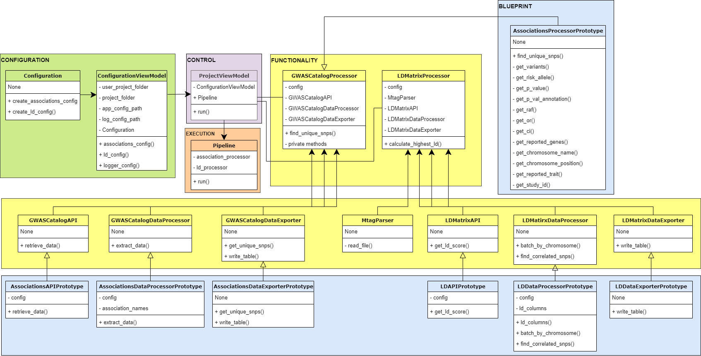

# GWAS Pipeline User and Setup Guide (release 1)

## Introduction

This guide covers the basic functionality and setup of a project for the GWAS pipeline. The GWAS pipeline searches a database of associations (for r1 the GWAS Catalog) using a trait ID or trait name to return an annotated table of associations and a list of unique variants. An LD score (from LDMatrix) is then retrieved between the unique variants and a supplied mTAG output for a specified reference population to return a table of the highest $R^2$ values.

> Note: `Release 1` is implemented using `Python 3.10`.

## Configuration
The application recieves instructions from two sources: (1) the `app_config.yml` and (2) the command line. Only the project folder can be set through both the config and the command line, with the project folder defined in the command line having preference. 

To run a new project, create a new folder. Place an MTAG file in that folder. Set the parameters in the config file (importantly, the mtag file name with the  names of the chromosome and rs ID columns). Set the final parameters in the command line to run the application.


### Global Application Settings

The application setup is configured in the `app_config.yml` config file which resides in `/global_config/`. 

**`app_config.yml`**

```yaml
project_folder: None
associations:
  api: gwas_catalog
  sig_p_value: 5e-8
  association_out_file: associations.csv
ld:
  api: ld_matrix
  ref_pop: CEU
  genome_build: grch37
  score: r
  mtag_in_file: jia_mtag_craft.txt
  snp_col: rsid
  chr_col: chromosome
  ld_out_file: ld_matrix.csv

```

1. **`project_folder`**: (optional) path to project folder; preference given to command-line input but at least one project folder is required
2. **`associations::api`**: name of the API to search for associations (valid APIs are enumerated in `/domain/enums/associations_api_type`), currently on GWAS Catalog is supported (https://www.ebi.ac.uk/gwas/)  
3. **`associations::sig_p_value`**: minimum p-value to filter associations for genome-wide significance
4. **`project_folder::association_out_file`**: (`.csv`) filename for CSV output of associations   
5. **`ld::api`**: name of the API to calculate LD score (valid APIs are enumerated in `/domain/enums/ld_api_type`), currently on LD Matrix is supported (https://ldlink.nci.nih.gov/?tab=ldmatrix)
6. **`ld::ref_pop`**: reference population for LD score calculations
7. **`ld::genome_build`**: coordinate system of the genome data source
8. **`ld::score`**: (default='r') measure of linkage disequilibrium to use
9. **`ld::mtag_in_file`**: (`.txt`) file path to mTAG TXT input for LD calculation
10. **`ld::snp_col`**: column name for SNP IDs in the mTAG file
11. **`ld::chr_col`**: column name for chromosome in the mTAG file
12. **`ld::ld_out_file`**: (`.csv`) filename for CSV output of highest pairwise ld score 

### API-Specific Settings

Based on the selected APIs in `app_config.yml`,  `key:value` mappings to access data fields are loaded from API-specific config files located in `/global_config/`. Keys include the urls to retrieve the data and paths to access the data field.

For example, **`gwas_catalog_config.yml`**:

```yaml
base_url: https://www.ebi.ac.uk/gwas/rest/api/
trait_code_url: efoTraits/search/findByEfoTrait?trait={}
associations_url: efoTraits/{}/associations?projection=associationByEfoTrait
valid_bases: ACTG?
efo_traits: _embedded/efoTraits
trait_code: _embedded/efoTraits/0/shortForm
associations: _embedded/associations
p_value: pvalue
...
```

## Running GWAS Pipeline

The pipeline is executed through `python gwas_pipeline.py` with the following arguments. Either an  `id` or `name` must be exclusively provided. 

`-id`				(`str`) search the configured database for associations using the trait ID code
`-n, --name`		(`str`) search the configured database for associations on trait name (trait name is used to find trait ID code)
`-c, --child`         	include associations for child traits (`True` if flag supplied; `False` is omitted)
`-o, --output`		(`str`) project folder path (overrides path provided in config)


## Release Notes
If child traits are included, the EFO codes of the children are retrived by querying the parent (supplied) EFO ID on the Ontology Lookup Service at https://www.ebi.ac.uk/ols/index. There may be discrepancies between the child traits returned from GWAS Catalog and the Ontology Lookup Service.

## Software Architecture

  

## Logging

The application setup is configured in the `log_config.yml` config file which resides in `/global_config/`.  This configuration typically does not require any modification unless changes to the default logging levels are required or other more advanced settings like logging formats, etc.

**`log_config.yml`**

```yaml
formatters:
  basic:
    datefmt: '%Y-%m-%d %H:%M:%S'
    format: '{asctime:s}:{levelname:s}:{name:s}:{message:s}'
    style: '{'
  control:
    format: '{message:s}'
    style: '{'
  verbose:
    datefmt: '%Y-%m-%d %H:%M:%S'
    format: '{asctime:s}:{levelname:s}:{name:s}:{lineno:d}:{message:s}'
    style: '{'
handlers:
  console:
    class: logging.StreamHandler
    formatter: control
    stream: ext://sys.stderr
loggers:
  gwas_pipeline:
    handlers:
    - console
    level: INFO
version: 1
```

##Disclaimer

Copyright (C) 2022 Martin J Page

This program is free software: you can redistribute it and/or modify
it under the terms of the GNU General Public License as published by
the Free Software Foundation, either version 3 of the License, or
(at your option) any later version.

```
This program is distributed in the hope that it will be useful,
but WITHOUT ANY WARRANTY; without even the implied warranty of
MERCHANTABILITY or FITNESS FOR A PARTICULAR PURPOSE.  See the
GNU General Public License for more details.

You should have received a copy of the GNU General Public License
along with this program.  If not, see <https://www.gnu.org/licenses/>.
```
